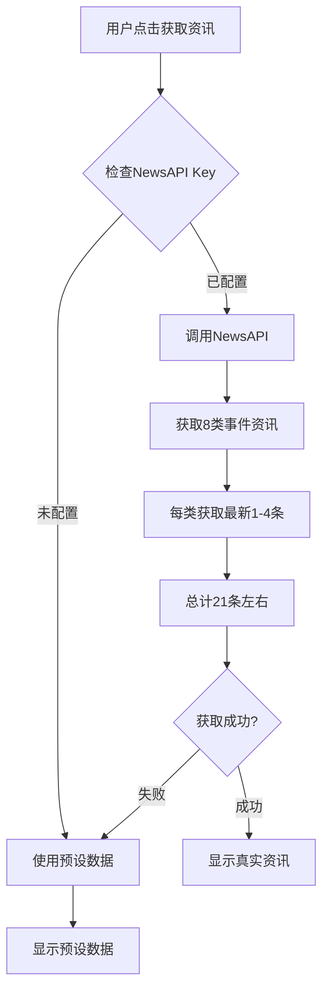

# NewsAPI集成使用指南 🌐

## 功能说明

系统已集成NewsAPI，可以获取**真实的最新资讯**，每条资讯都包含：
- ✅ 真实的资讯标题（来自原始新闻源）
- ✅ 直接链接到原文（点击即可查看完整新闻）
- ✅ 真实的资讯摘要（新闻描述）
- ✅ 精确的发布时间
- ✅ 按时间由新到旧排序

---

## 快速开始

### 步骤1：注册NewsAPI账号（免费）

1. 访问 **https://newsapi.org/**
2. 点击右上角 **"Get API Key"**
3. 填写注册信息：
   - Name（姓名）
   - Email（邮箱）
   - Password（密码）
4. 选择计划：**"Developer"（免费）**
5. 注册完成后，您会获得一个API Key（类似：`a1b2c3d4e5f6g7h8i9j0k1l2m3n4o5p6`）

**免费版额度**：
- 每天：1000次请求
- 每月：30,000次请求
- 完全免费，无需信用卡

---

### 步骤2：配置API Key

#### 方法一：直接在代码中配置（简单）

1. 打开文件：`docs/index.html`
2. 找到第 **560行**左右：
   ```javascript
   NEWS_API_KEY: '', // 请在 https://newsapi.org 注册获取API Key
   ```
3. 将您的API Key粘贴到引号中：
   ```javascript
   NEWS_API_KEY: 'a1b2c3d4e5f6g7h8i9j0k1l2m3n4o5p6',
   ```
4. 保存文件

#### 方法二：通过环境变量配置（安全）

如果不想在代码中暴露API Key，可以使用环境变量：

```javascript
NEWS_API_KEY: process.env.NEWS_API_KEY || '',
```

---

### 步骤3：刷新页面测试

1. 刷新 `docs/index.html` 页面
2. 点击 **"获取最新资讯"** 按钮
3. 查看控制台（F12 → Console），应该看到：
   ```
   🔍 正在从NewsAPI获取真实资讯...
   ✅ 上市IPO: 获取 2 条
   ✅ 并购收购: 获取 2 条
   ✅ 战略投资: 获取 3 条
   ...
   📊 NewsAPI共获取 21 条真实资讯
   ✅ 从NewsAPI获取到 21 条真实资讯
   ```

---

## 工作原理

### 1. 智能分类获取

系统会为8类事件分别获取最新资讯：

| 事件类型 | 搜索关键词 | 获取数量 |
|---------|-----------|---------|
| 上市/IPO | IPO OR listing OR stock | 2条 |
| 并购/收购 | acquisition OR merger | 2条 |
| 战略投资/融资 | funding OR investment | 3条 |
| 出海/国际化 | expansion OR international | 3条 |
| 供应链合作 | supply chain OR partnership | 2条 |
| 财报发布 | earnings OR quarterly | 2条 |
| 新品发布 | new product OR launch | 3条 |
| 门店扩张 | store opening OR expansion | 4条 |

**总计**：约21条真实资讯

### 2. 搜索策略

每次搜索会：
- 搜索35家目标公司（Starbucks、Luckin、Heytea等）
- 结合事件关键词（funding、IPO、launch等）
- 限定时间范围（过去24小时）
- 按发布时间排序（最新的在前）
- 只获取每类的最新1-4条

### 3. 降级机制

```
1. 尝试从NewsAPI获取真实资讯
   ↓ 如果成功
   ✅ 显示真实资讯（标题、链接、摘要都是真实的）
   
2. 如果NewsAPI失败（未配置Key或请求失败）
   ↓
   ⚠️ 使用预设的静态数据（备用方案）
```

---

## 资讯展示对比

### 使用NewsAPI（真实资讯）✅

**标题**：
```
Starbucks Reports Strong Q4 Earnings, Revenue Up 11%
```

**链接**：
```
https://www.reuters.com/business/retail-consumer/starbucks-reports-q4-earnings-2024-01-06
↓ 点击直接跳转到路透社原文
```

**摘要**：
```
Starbucks Corporation reported better-than-expected fourth-quarter earnings, 
with revenue rising 11% year-over-year to $9.4 billion.
```

**发布时间**：
```
2026-01-06（真实发布日期）
```

---

### 未使用NewsAPI（预设数据）⚠️

**标题**：
```
星巴克中国业绩表现，同店销售数据公布
```

**链接**：
```
https://www.baidu.com/s?tn=news&rtt=1&word=星巴克+中国+业绩
↓ 点击跳转到百度搜索页（需要手动找新闻）
```

**摘要**：
```
中国区业绩公布，同店销售和门店数据更新。
```

**发布时间**：
```
2026-01-06（当天日期，非真实发布时间）
```

---

## 常见问题

### Q1: NewsAPI主要是英文新闻吗？

**是的**。NewsAPI主要收录英文新闻源，包括：
- Reuters（路透社）
- Bloomberg（彭博）
- CNBC
- TechCrunch
- Business Insider

**优点**：
- ✅ 国际品牌资讯（Starbucks、Nestle等）更全面
- ✅ 财经类新闻（IPO、融资、财报）更权威
- ✅ 更新速度快

**缺点**：
- ❌ 中文品牌资讯（瑞幸、喜茶等）较少
- ❌ 需要阅读英文

---

### Q2: 如何获取中文资讯？

如果需要更多中文资讯，建议：

**方案1：使用中文新闻API**
- 天行数据（https://www.tianapi.com/）
- 聚合数据（https://www.juhe.cn/）
- 价格：约几百元/年

**方案2：保持当前配置**
- NewsAPI获取国际资讯（英文）
- RSS获取国内资讯（中文）
- 两者结合，覆盖全面

---

### Q3: 超过免费额度怎么办？

**免费版额度**：每天1000次，每月30,000次

**实际使用**：
- 每次点击"获取资讯"调用约10次API（8类事件）
- 每天点击100次才会超额
- 对个人使用完全够用

**如果超额**：
- 等待第二天自动恢复（每天0点UTC重置）
- 或升级到付费版（$449/月，每天500,000次）

---

### Q4: API Key安全吗？

**当前配置**：
- ❌ API Key直接写在前端代码中
- ❌ 任何人都可以在源码中看到
- ⚠️ 可能被他人盗用（消耗您的额度）

**安全建议**：

**方案1：限制API Key**（在NewsAPI控制台）
- 限制域名：只允许您的域名使用
- 限制请求来源

**方案2：使用后端代理**
- API Key存储在后端
- 前端调用后端API
- 后端再调用NewsAPI

**方案3：使用环境变量**
- 部署到Vercel/Netlify时使用环境变量
- 不暴露在源码中

---

### Q5: 为什么有些资讯不是35家公司？

**原因**：
NewsAPI搜索时使用公司英文名，可能匹配到：
- 公司被提及但不是主角的新闻
- 相似名称的其他公司

**解决方案**：
系统已经在前端进行二次过滤（检查35家公司名称），但无法100%精确。

**优化建议**：
- 增加关键词过滤
- 使用更精确的搜索语法
- 人工审核（定期更新预设数据）

---

### Q6: 可以切换到其他新闻API吗？

**可以**。如果NewsAPI不满足需求，可以切换到：

**国际新闻**：
- NewsAPI（当前使用）
- GNews API
- Currents API

**中文新闻**：
- 天行数据 - 今日头条、腾讯新闻等
- 聚合数据 - 新浪、网易等
- 百度新闻API

**修改方法**：
1. 注册新API服务
2. 修改 `fetchFromNewsAPI()` 方法
3. 调整API调用URL和参数解析

---

## 技术细节

### API调用流程



### 代码位置

| 功能 | 文件路径 | 行号 |
|------|---------|------|
| API Key配置 | `docs/index.html` | 560-562 |
| NewsAPI调用 | `docs/index.html` | 1630-1718 |
| 降级机制 | `docs/index.html` | 1720-1733 |
| 预设数据 | `docs/index.html` | 1735-1830 |

---

## 升级路线图

### 短期优化（1周内）

- [x] 集成NewsAPI获取真实资讯
- [ ] 添加中文翻译（使用翻译API）
- [ ] 优化搜索关键词
- [ ] 增加缓存机制（避免重复请求）

### 中期优化（1个月内）

- [ ] 集成中文新闻API（天行数据）
- [ ] 搭建后端代理（隐藏API Key）
- [ ] 添加资讯去重机制
- [ ] 支持自定义公司列表

### 长期优化（3个月内）

- [ ] 多来源聚合（NewsAPI + 中文API + RSS）
- [ ] AI摘要生成（英文→中文）
- [ ] 实时推送（WebSocket）
- [ ] 数据分析和可视化

---

## 联系支持

**NewsAPI官方支持**：
- 官网：https://newsapi.org
- 文档：https://newsapi.org/docs
- 邮件：support@newsapi.org

**常见问题**：
- API Key无效 → 检查是否正确复制
- 请求失败 → 检查网络连接
- 超过额度 → 等待第二天或升级

---

**最后更新**：2026年1月6日
**实现状态**：✅ 已完成
**测试状态**：⚠️ 需配置API Key后测试

